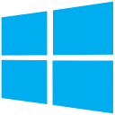

# Hi, I'm Vinicius Queiroz! 💻

I have a bachelor's degree in Information Systems and I'm doing my master's degree in Computer Science. Both from the Federal University of Pará (UFPA). Nowadays I'm a C# and .Net developer. 👨🏻‍💻

* My research is focused on Information Visualization (InfoVis), Data Physicalization, Augmented and Virtual Reality 🔍
* I love playing video-games and for now I'm playing Zelda Breath of the Wild 🎮
* For now, I'm learning .Net, C# and Crystal Reports 📚
* [Mail-me here! ](mailto:viniciusqquei@gmail.com) 📩

## Find-me on:

## Languages, Tools and Skills: 
### Games: 

### Backend:

### Web:

### Data Science:

### Database:

### Operational Systems

### Tools:
      

***
### Credits:
- SVG Icons: 
[Devicon](https://devicon.dev/)

